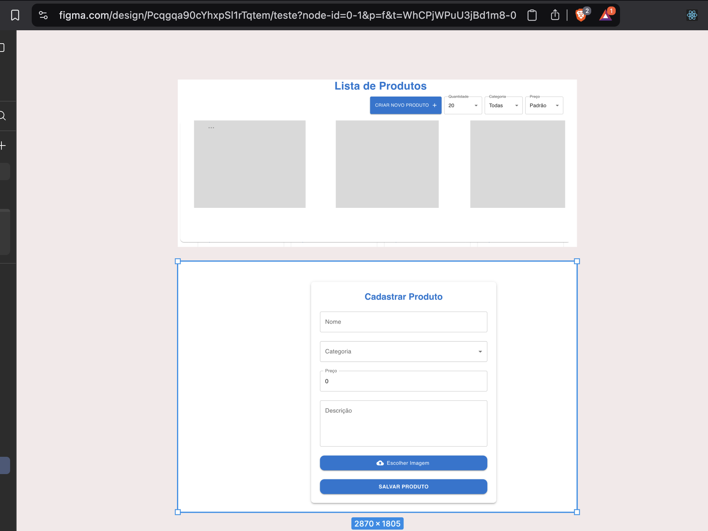

# 🛒 E-Commerce App (Next.js)

Este é um projeto desenvolvido com [Next.js](https://nextjs.org), criado com [`create-next-app`](https://nextjs.org/docs/app/api-reference/cli/create-next-app).


## 🚀 Como Rodar o Projeto

1. **Clone o repositório**
   ```bash
   git clone https://github.com/LuisEduardo21/Crud_Store
   cd store-crud
   npm install
   npm run dev ou npx next dev
   ```
   Acesse http://localhost:3000 para ver a aplicação rodando.

🔧 Tecnologias Utilizadas
• Next.js - Framework React para produção
• TypeScript - Tipagem estática para maior segurança
• Material UI - Biblioteca de componentes estilizados
• Axios - Requisições HTTP simplificadas
• JSON Server - API mock para desenvolvimento local

📚 Aprenda mais sobre Next.js

- [📖 Documentação Oficial](https://nextjs.org/docs)
- [🚀 Tutorial Interativo](https://nextjs.org/learn)
- [💻 Repositório no GitHub](https://github.com/vercel/next.js)



📝 Autor: Luis Eduardo Araujo F da Silva
📧 Contato: lfdasilva9@hotmail.com
